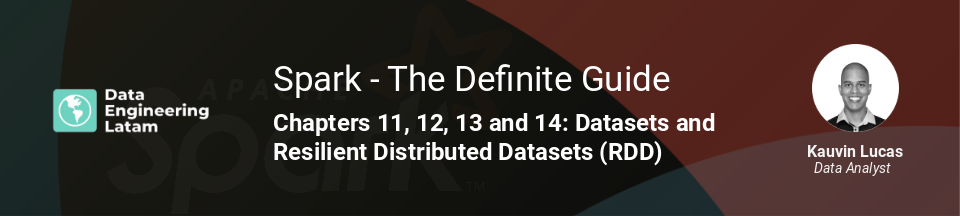

## Session 10
### Chapters 11,12,13 & 14 - Datasets and Resilient Distributed Datasets (RDDs)

### Resumen
Durante esta sesión conocimos a la API denominada Dataset, antes de profundizarnos respecto a la estructura de datos central de Apache Spark: el Resilient Distributed Dataset (RDD)

#### Grabación de la sesión

#### Nuestras redes sociales
* [Youtube](https://www.youtube.com/channel/UCqFCoUEvxR23ymmih0GD7mQ?sub_confirmation=1 'Subscríbate al canal')
* [Linkedin](https://www.linkedin.com/company/data-engineering-latam/ 'Síganos en Linkedin')
* [Facebook](https://www.facebook.com/dataengineeringlatam/ 'Síganos en Facebook')
* [Website](https://beacons.ai/dataengineeringlatam 'Nuestro website')
