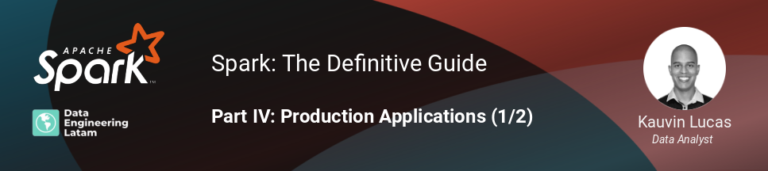

## Session 11
### Part IV - Production Applications (1/2)

*Observación: esta es la primera de dos sesiones sobre Part IV. Production Applications.*

### Resumen
Hasta ahora, hemos enfocado en las propiedades de Spark como interfaz de programación. En esta sesión, nos enfocamos en los tópicos relevantes sobre la implementación de aplicaciones en Spark, conociendo la arquitectura, componentes y ciclo de vida de una aplicación, los pasos necesarios para ejecutarlo, cómo desarrollarlo y qué opciones Spark nos ofrece para implementarlo.

#### Grabación de la sesión

#### Nuestras redes sociales
* [Youtube](https://www.youtube.com/channel/UCqFCoUEvxR23ymmih0GD7mQ?sub_confirmation=1 'Subscríbate al canal')
* [Linkedin](https://www.linkedin.com/company/data-engineering-latam/ 'Síganos en Linkedin')
* [Facebook](https://www.facebook.com/dataengineeringlatam/ 'Síganos en Facebook')
* [Website](https://beacons.ai/dataengineeringlatam 'Nuestro website')
