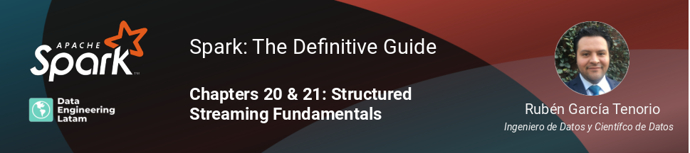

## Session 13
### Chapters 20 & 21 - Structured Streaming Fundamentals

### Resumen
En esta sesión, conoceremos las ventajas del procesamiento en streaming y nos introduciremos al tema del Structured Streaming en Apache Spark. El procesamiento en streaming es clave en diversas aplicaciones de Big Data. Apache Spark tiene una larga historia de soporte al procesamiento en streaming. El API de Structured Streaming fue la más reciente incorporación de Apache Spark, que integra las virtudes relacionadas a la facilidad y optimización de las consultas en Spark SQL.

#### Grabación de la sesión

#### Nuestras redes sociales
* [Youtube](https://www.youtube.com/channel/UCqFCoUEvxR23ymmih0GD7mQ?sub_confirmation=1 'Subscríbate al canal')
* [Linkedin](https://www.linkedin.com/company/data-engineering-latam/ 'Síganos en Linkedin')
* [Facebook](https://www.facebook.com/dataengineeringlatam/ 'Síganos en Facebook')
* [Website](https://beacons.ai/dataengineeringlatam 'Nuestro website')
