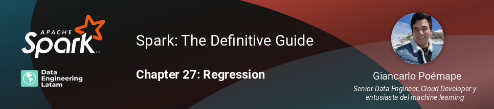

## Session 19 - Modelos de regresión con Spark Machine Learning
### Chapter 27 - Regression

### Resumen
En esta sesión, seguiremos estudiando los módulos del MLlib para resolver los problemas de aprendizaje automático en Apache Spark. Nos acercaremos a los modelos de regresión y exploraremos los hiperparámetros comúnmente ajustados.

#### Grabación de la sesión

#### Nuestras redes sociales
* [Youtube](https://www.youtube.com/channel/UCqFCoUEvxR23ymmih0GD7mQ?sub_confirmation=1 'Subscríbate al canal')
* [Linkedin](https://www.linkedin.com/company/data-engineering-latam/ 'Síganos en Linkedin')
* [Facebook](https://www.facebook.com/dataengineeringlatam/ 'Síganos en Facebook')
* [Website](https://beacons.ai/dataengineeringlatam 'Nuestro website')
