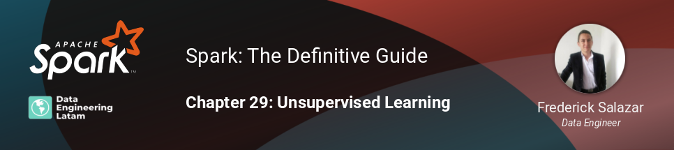

## Session 22 - Modelos de aprendizaje no supervisado con Spark Machine Learning
### Chapter 29 - Unsupervised Learning

### Resumen
Estaremos estudiando una vez más los modelos del MLlib de Apache Spark para resolver problemas de machine learning. Ahora, exploraremos las herramientas disponibles para el aprendizaje no supervisado, enfocándonos especificamente en el clustering, y veremos los desafíos de entrenar estos modelos en un entorno de computación distribuído.

#### Grabación de la sesión
Pendiente

#### Nuestras redes sociales
* [Youtube](https://www.youtube.com/channel/UCqFCoUEvxR23ymmih0GD7mQ?sub_confirmation=1 'Subscríbate al canal')
* [Linkedin](https://www.linkedin.com/company/data-engineering-latam/ 'Síganos en Linkedin')
* [Facebook](https://www.facebook.com/dataengineeringlatam/ 'Síganos en Facebook')
* [Website](https://beacons.ai/dataengineeringlatam 'Nuestro website')
