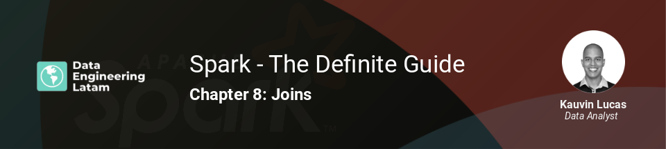

## Session 8
### Chapter 8 - Joins

### Resumen
Esta sesión abordó diferentes temas relacionados a las operaciones de joins en Apache Spark, así como las diferentes maneras de optimizarlas. Entre los temas estaban:

* Join expressions
* Tipos de joins
* Cómo Spark realiza los joins
* Desafíos frecuentes de las operaciones de joins

Ejemplos de cada uno de los temas fueron ejecutados en un notebook denominado [`Spark Joins.ipynb`](Spark%20Joins.ipynb)

#### Grabación de la sesión

#### Nuestras redes sociales
* [Youtube](https://www.youtube.com/channel/UCqFCoUEvxR23ymmih0GD7mQ?sub_confirmation=1 'Subscríbate al canal')
* [Linkedin](https://www.linkedin.com/company/data-engineering-latam/ 'Síganos en Linkedin')
* [Facebook](https://www.facebook.com/dataengineeringlatam/ 'Síganos en Facebook')
* [Website](https://beacons.ai/dataengineeringlatam 'Nuestro website')
