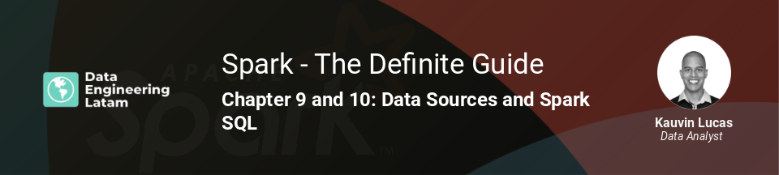

## Session 9
### Chapter 9 & 10 - Data Sources API and Spark SQL

### Resumen
Esta sesión trató de introducirnos a la variedad de fuentes de datos que se pueden utilizar en Apache Spark, y las diferentes interfaces que nos permitirían hacer las conexiones a los datos. También se habló sobre el Spark SQL, una de las funcionalidades más importantes de Spark.

Entre los temas principales estaban:
- Data Sources API
- Trabajando con datos de fuentes internas
- Trabajando con datos de fuentes externas
- User-Defined Functions
- Trabajando con datos del tipo complejo

Ejemplos de cada uno de los temas fueron ejecutados en un notebook denominado [`Data Sources and Spark SQL.ipynb`](Data%20Sources%20and%20Spark%20SQL.ipynb).

Observación: el notebook ejecutado en un entorno creado con Docker Compose. El archivo YAML para crear el entorno se encuentra en este [repositorio](https://github.com/rodrigo-reboucas/docker-bigdata). Los conjuntos de datos que fueron cargados al MySQL y al HDFS se encuentran [aquí](../../data/).

#### Grabación de la sesión

#### Nuestras redes sociales
* [Youtube](https://www.youtube.com/channel/UCqFCoUEvxR23ymmih0GD7mQ?sub_confirmation=1 'Subscríbate al canal')
* [Linkedin](https://www.linkedin.com/company/data-engineering-latam/ 'Síganos en Linkedin')
* [Facebook](https://www.facebook.com/dataengineeringlatam/ 'Síganos en Facebook')
* [Website](https://beacons.ai/dataengineeringlatam 'Nuestro website')
